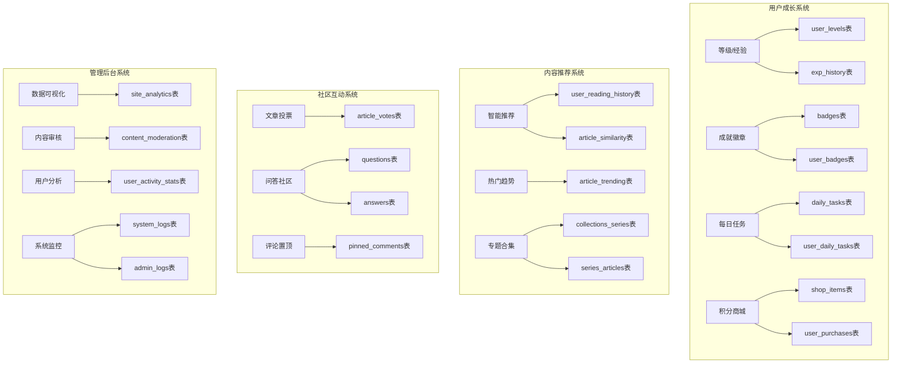
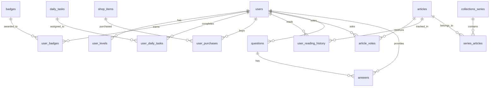

# 第二轮大规模功能更新 - 架构设计文档

## 📋 功能概览

### 一、用户成长系统
| 功能 | 复杂度 | 依赖 |
|------|--------|------|
| 等级/经验系统 | ⭐⭐⭐ | 用户表、经验记录表 |
| 成就徽章系统 | ⭐⭐⭐ | 徽章表、用户徽章关联表 |
| 每日任务系统 | ⭐⭐⭐ | 任务表、任务进度表 |
| 积分商城 | ⭐⭐⭐⭐ | 商品表、购买记录表 |

### 二、内容发现与推荐
| 功能 | 复杂度 | 依赖 |
|------|--------|------|
| 智能推荐算法 | ⭐⭐⭐⭐⭐ | 阅读历史表、相似度计算 |
| 相关文章推荐 | ⭐⭐ | 文章标签、分类 |
| 热门趋势榜 | ⭐⭐⭐ | 文章统计表 |
| 专题合集 | ⭐⭐⭐ | 专题表、专题文章关联表 |

### 三、社区互动增强
| 功能 | 复杂度 | 依赖 |
|------|--------|------|
| 文章投票系统 | ⭐⭐ | 投票表 |
| 问答社区 | ⭐⭐⭐⭐ | 问题表、回答表 |
| 评论置顶 | ⭐⭐ | 置顶评论表 |
| @提及增强 | ⭐⭐ | 现有提及系统扩展 |

### 四、管理后台功能
| 功能 | 复杂度 | 依赖 |
|------|--------|------|
| 数据可视化仪表板 | ⭐⭐⭐⭐ | 统计表、图表组件 |
| 内容审核系统 | ⭐⭐⭐⭐ | 审核队列表 |
| 用户行为分析 | ⭐⭐⭐⭐ | 活动统计表 |
| 系统日志监控 | ⭐⭐⭐ | 日志表 |

---

## 🏗️ 系统架构



---

## 🗄️ 数据库设计

### 核心表关系图



---

## 🔌 API 设计

### 用户成长系统 API
```
GET    /level                    - 获取用户等级信息
GET    /exp/history              - 获取经验值历史
GET    /badges                   - 获取所有徽章
GET    /badges/my                - 获取用户徽章
POST   /badges/equip             - 装备/取消装备徽章
GET    /tasks/daily              - 获取每日任务
POST   /shop/buy                 - 购买商品
GET    /shop/items               - 获取商城商品
GET    /shop/purchases           - 获取购买记录
```

### 内容推荐系统 API
```
GET    /personalized             - 个性化推荐
GET    /related/:articleId       - 相关文章
GET    /trending                 - 热门趋势
GET    /series                   - 专题合集列表
GET    /series/:id               - 专题详情
POST   /series                   - 创建专题
PUT    /series/:id               - 更新专题
DELETE /series/:id               - 删除专题
```

### 社区互动 API
```
GET    /votes/:articleId         - 获取投票统计
POST   /votes                    - 投票
GET    /questions                - 问题列表
GET    /questions/:id            - 问题详情
POST   /questions                - 创建问题
POST   /questions/:id/answers    - 创建回答
POST   /answers/:id/accept       - 采纳回答
GET    /pinned-comments/:articleId - 置顶评论
POST   /comments/:id/pin         - 置顶评论
```

### 管理后台 API
```
GET    /admin-dashboard/overview          - 概览统计
GET    /admin-dashboard/user-growth       - 用户增长
GET    /admin-dashboard/activity-trend    - 活跃度趋势
GET    /admin-dashboard/top-articles      - 热门文章
GET    /admin-dashboard/moderation/queue  - 审核队列
POST   /admin-dashboard/moderation/review - 审核内容
GET    /admin-dashboard/analytics/user-activity - 用户分析
GET    /admin-dashboard/logs              - 系统日志
```

---

## 🎨 前端组件设计

### 用户成长组件
- `LevelProgress` - 等级进度条
- `BadgeGallery` - 徽章展示墙
- `DailyTaskList` - 每日任务列表
- `ShopItemCard` - 商城商品卡片
- `ExpHistoryChart` - 经验值历史图表

### 内容推荐组件
- `RecommendationFeed` - 推荐文章流
- `RelatedArticles` - 相关文章区块
- `TrendingList` - 热门趋势列表
- `SeriesCollection` - 专题合集展示
- `ArticleCard` - 文章卡片（增强版）

### 社区互动组件
- `VoteButtons` - 投票按钮组
- `QuestionList` - 问题列表
- `QuestionDetail` - 问题详情页
- `AnswerEditor` - 回答编辑器
- `PinnedComment` - 置顶评论

### 管理后台组件
- `DashboardStats` - 仪表板统计卡片
- `LineChart` - 折线图表
- `PieChart` - 饼图
- `ModerationQueue` - 审核队列表格
- `LogViewer` - 日志查看器

---

## 📊 实施计划

### 阶段1: 基础架构 (已完成 ✅)
- [x] 数据库迁移文件
- [x] 后端API路由框架
- [x] app.js路由注册

### 阶段2: 用户成长系统
- [ ] 经验系统后端逻辑
- [ ] 徽章系统实现
- [ ] 每日任务系统
- [ ] 积分商城实现
- [ ] 前端用户中心页面

### 阶段3: 内容推荐系统
- [ ] 阅读历史跟踪
- [ ] 推荐算法实现
- [ ] 热门趋势计算
- [ ] 专题合集功能
- [ ] 前端推荐组件

### 阶段4: 社区互动系统
- [ ] 文章投票功能
- [ ] 问答社区功能
- [ ] 评论置顶功能
- [ ] 前端问答页面

### 阶段5: 管理后台系统
- [ ] 数据统计API
- [ ] 内容审核系统
- [ ] 用户分析功能
- [ ] 系统日志记录
- [ ] 前端管理仪表板

---

## 🔧 技术要点

### 经验值计算
```javascript
// 经验值需求公式：指数增长
function getExpForLevel(level) {
    return Math.floor(100 * Math.pow(1.2, level - 1));
}

// 获取等级称号
function getLevelTitle(level) {
    const titles = {
        1: '新手',
        5: '初级用户',
        10: '活跃用户',
        20: '资深用户',
        30: '社区达人',
        50: '传奇用户'
    };
    // 返回对应等级或更低等级的称号
    const levels = Object.keys(titles).map(Number).sort((a, b) => b - a);
    for (const l of levels) {
        if (level >= l) return titles[l];
    }
    return '新手';
}
```

### 推荐算法思路
1. **协同过滤** - 基于用户相似度推荐
2. **内容匹配** - 基于标签、分类匹配
3. **热度加权** - 结合时间衰减的热门算法
4. **混合推荐** - 多种算法结果融合

### 审核系统工作流
```
内容提交 → AI预审核 → 人工审核 → 发布/拒绝
              ↓
         高风险内容 → 人工审核队列
         低风险内容 → 自动通过
```

---

## 📝 注意事项

1. **性能优化**
   - 推荐算法使用缓存（Redis）
   - 统计数据使用预计算
   - 日志表使用分区存储

2. **安全性**
   - 所有管理接口需要admin权限
   - 经验值操作需要防刷机制
   - 内容审核需要敏感词过滤

3. **扩展性**
   - 徽章系统设计为可配置
   - 任务系统支持动态添加
   - 商城商品支持多种类型

4. **数据一致性**
   - 使用数据库事务处理金币交易
   - 经验值操作使用队列防止并发问题
