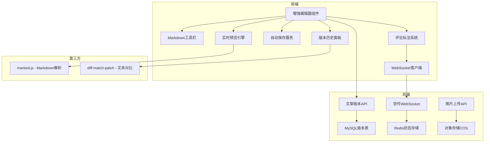

# 内容创作增强功能规划

## 概述
为现有的Markdown编辑器添加专业级内容创作功能，提升写作体验和协作能力。

---

## 功能模块

### 1. 富文本编辑器增强 ⭐

**目标**：将简单的文本域升级为功能完善的Markdown编辑器

#### 1.1 Markdown工具栏
- 快捷格式按钮：粗体、斜体、删除线
- 标题层级选择（H1-H6）
- 列表按钮：有序列表、无序列表、任务列表
- 插入功能：链接、图片、代码块、引用块、分隔线
- 表格插入工具

#### 1.2 实时预览分屏
- 左侧编辑区 + 右侧预览区的分屏布局
- 同步滚动（编辑区与预览区位置同步）
- 预览模式切换：分屏/全屏编辑/全屏预览

#### 1.3 图片上传增强
- 拖拽图片到编辑器自动上传
- 粘贴剪贴板图片直接插入
- 图片上传进度显示
- 自动压缩和生成缩略图

#### 1.4 自动保存机制
- 每30秒自动保存到localStorage
- 网络恢复后自动同步到服务端
- 显示上次保存时间
- 浏览器崩溃后恢复提示

### 2. 文章版本历史系统 📜

**目标**：保存文章修改历史，支持版本回溯

#### 2.1 后端数据库设计
```sql
CREATE TABLE article_versions (
  id INT PRIMARY KEY AUTO_INCREMENT,
  article_id VARCHAR(255) NOT NULL,
  user_id VARCHAR(255) NOT NULL,
  version_number INT NOT NULL,
  title VARCHAR(255),
  content TEXT,
  change_summary VARCHAR(255), -- 变更摘要
  created_at TIMESTAMP DEFAULT CURRENT_TIMESTAMP,
  INDEX idx_article_id (article_id),
  INDEX idx_version (article_id, version_number)
);
```

#### 2.2 API接口
- `POST /articles/:id/versions` - 保存新版本
- `GET /articles/:id/versions` - 获取版本列表
- `GET /articles/:id/versions/:versionId` - 获取特定版本
- `POST /articles/:id/versions/:versionId/restore` - 回滚到指定版本

#### 2.3 前端功能
- 版本历史侧边栏
- 版本对比视图（高亮差异）
- 一键回滚按钮
- 版本备注说明

### 3. 协作与评论标注 🤝

**目标**：支持多人协作和审阅批注

#### 3.1 行内评论批注
- 选中文字添加评论
- 显示评论气泡标记
- 评论回复和解决状态
- 评论通知提醒

#### 3.2 文章分享协作
- 生成分享链接
- 权限设置：只读/评论/编辑
- 协作者管理面板
- 协作邀请邮件

#### 3.3 编辑冲突处理
- WebSocket实时同步
- 编辑锁定机制（乐观锁）
- 显示当前编辑者头像
- 冲突时显示差异对比选项

#### 3.4 协作者状态
- 显示在线协作者列表
- 光标位置实时同步
- 编辑区域高亮提示

---

## 技术架构



---

## 数据库迁移脚本

```sql
-- 文章版本表
CREATE TABLE IF NOT EXISTS article_versions (
  id INT AUTO_INCREMENT PRIMARY KEY,
  article_id VARCHAR(255) NOT NULL COMMENT '文章ID或临时ID',
  user_id VARCHAR(255) NOT NULL COMMENT '编辑者ID',
  version_number INT NOT NULL COMMENT '版本号',
  title VARCHAR(255) COMMENT '文章标题',
  content TEXT COMMENT '文章内容',
  change_summary VARCHAR(255) COMMENT '变更说明',
  word_count INT DEFAULT 0 COMMENT '字数统计',
  created_at TIMESTAMP DEFAULT CURRENT_TIMESTAMP,
  UNIQUE KEY uk_article_version (article_id, version_number),
  KEY idx_article_id (article_id),
  KEY idx_user_id (user_id),
  KEY idx_created_at (created_at)
) ENGINE=InnoDB DEFAULT CHARSET=utf8mb4 COLLATE=utf8mb4_unicode_ci COMMENT='文章版本历史';

-- 文章评论批注表
CREATE TABLE IF NOT EXISTS article_annotations (
  id INT AUTO_INCREMENT PRIMARY KEY,
  article_id VARCHAR(255) NOT NULL COMMENT '文章ID',
  user_id VARCHAR(255) NOT NULL COMMENT '评论者ID',
  version_id INT COMMENT '关联版本ID',
  selected_text TEXT COMMENT '选中的文本',
  start_offset INT COMMENT '起始位置',
  end_offset INT COMMENT '结束位置',
  comment TEXT NOT NULL COMMENT '评论内容',
  parent_id INT DEFAULT NULL COMMENT '父评论ID（支持回复）',
  status ENUM('open', 'resolved', 'dismissed') DEFAULT 'open',
  created_at TIMESTAMP DEFAULT CURRENT_TIMESTAMP,
  updated_at TIMESTAMP DEFAULT CURRENT_TIMESTAMP ON UPDATE CURRENT_TIMESTAMP,
  KEY idx_article_id (article_id),
  KEY idx_user_id (user_id),
  KEY idx_version_id (version_id),
  KEY idx_parent_id (parent_id)
) ENGINE=InnoDB DEFAULT CHARSET=utf8mb4 COLLATE=utf8mb4_unicode_ci COMMENT='文章批注评论';

-- 协作编辑锁表
CREATE TABLE IF NOT EXISTS article_edit_locks (
  article_id VARCHAR(255) PRIMARY KEY COMMENT '文章ID',
  user_id VARCHAR(255) NOT NULL COMMENT '当前编辑者ID',
  user_name VARCHAR(100) COMMENT '编辑者名称',
  lock_token VARCHAR(255) NOT NULL COMMENT '锁令牌',
  expires_at TIMESTAMP NOT NULL COMMENT '过期时间',
  created_at TIMESTAMP DEFAULT CURRENT_TIMESTAMP,
  KEY idx_expires_at (expires_at)
) ENGINE=InnoDB DEFAULT CHARSET=utf8mb4 COLLATE=utf8mb4_unicode_ci COMMENT='文章编辑锁';
```

---

## 优先级建议

### 🔥 第一优先级（核心功能）
1. Markdown工具栏 - 立即提升编辑体验
2. 自动保存草稿 - 防止数据丢失
3. 版本历史基础功能 - 文章版本管理

### ⭐ 第二优先级（增强体验）
4. 实时预览分屏 - 可视化编辑
5. 图片拖拽上传 - 图片处理优化
6. 版本对比功能 - 版本管理完善

### 🌟 第三优先级（协作高级）
7. 行内评论批注
8. 协作文档分享
9. 实时协作编辑

---

## 预计工作量

| 功能模块 | 预估工时 | 复杂度 |
|---------|---------|--------|
| Markdown工具栏 | 2h | ⭐⭐ |
| 实时预览 | 3h | ⭐⭐⭐ |
| 自动保存 | 2h | ⭐⭐ |
| 版本历史系统 | 4h | ⭐⭐⭐ |
| 评论批注 | 4h | ⭐⭐⭐⭐ |
| 协作功能 | 6h | ⭐⭐⭐⭐⭐ |

**总计：约21小时**

建议分批实施，先完成第一优先级的核心功能（约7小时）。
