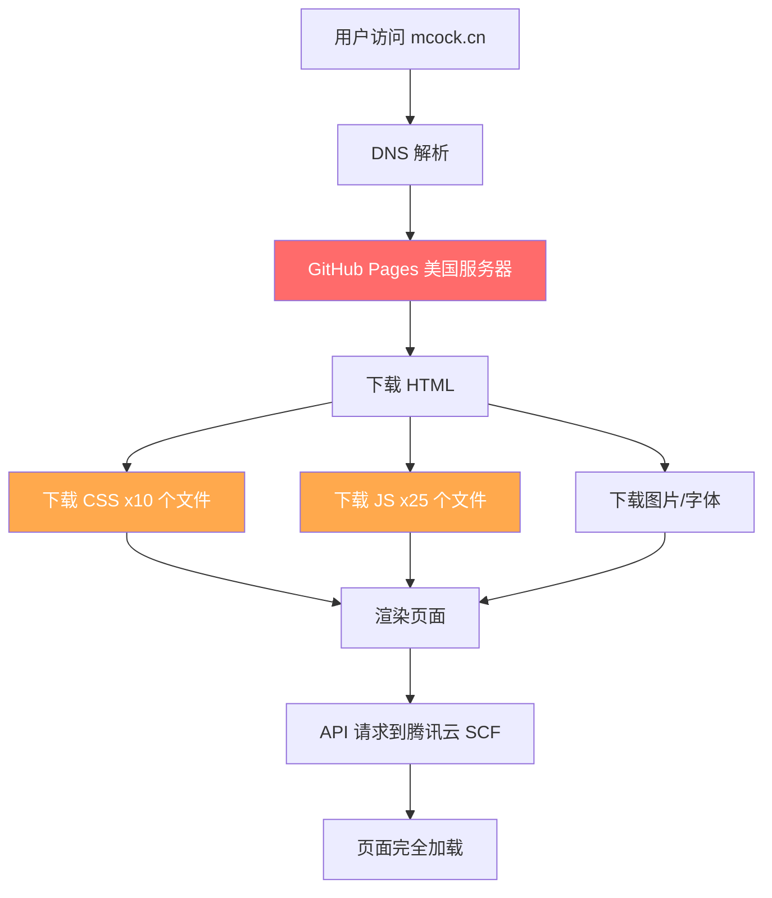
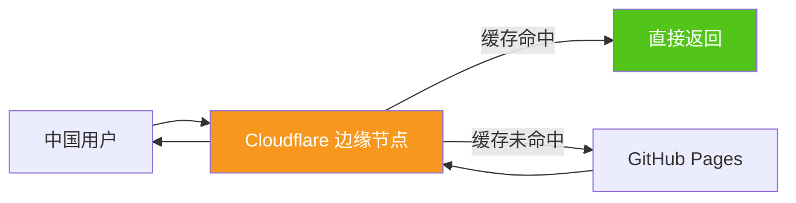

# 🚀 网站加速优化方案

## 当前性能瓶颈分析



### 主要问题

| 问题 | 影响 | 严重程度 |
|------|------|----------|
| GitHub Pages 服务器在美国 | 中国用户 DNS + TCP 延迟 200-500ms | ⭐⭐⭐⭐⭐ |
| 25 个独立 JS 文件 | 每个文件一次 HTTP 请求 | ⭐⭐⭐⭐ |
| 10 个独立 CSS 文件 | 阻塞渲染的请求过多 | ⭐⭐⭐ |
| pace.min.js 在 head 同步加载 | 阻塞 HTML 解析 | ⭐⭐⭐ |
| jQuery 2.x 和 3.x 同时存在 | 重复加载，浪费带宽 | ⭐⭐ |
| 无 preconnect/dns-prefetch | API 域名首次连接慢 | ⭐⭐ |
| 图片未使用 WebP 格式 | 文件体积大 | ⭐⭐ |
| 无 Service Worker 缓存 | 每次访问都重新下载 | ⭐⭐ |

---

## 优化方案（分三个阶段）

### 第一阶段：代码层面优化（立即见效，零成本）

#### 1.1 HTML 优化
- 在 `<head>` 中添加 `dns-prefetch` 和 `preconnect`，提前解析 API 域名
- 将非关键 JS 添加 `defer` 属性，避免阻塞渲染
- 添加 `<meta>` 缓存控制头

**修改文件：** `index-chinese.html`, `article.html`, `coins.html`, `profile.html`, `editor.html`, `drive.html`, `games.html`

```html
<!-- 添加到 <head> 顶部 -->
<link rel="dns-prefetch" href="//1321178544-65fvlfs2za.ap-beijing.tencentscf.com">
<link rel="preconnect" href="https://1321178544-65fvlfs2za.ap-beijing.tencentscf.com" crossorigin>
```

#### 1.2 JS 优化
- 移除未使用的 `firebase-auth.js`（已迁移到自建后端）
- 移除 `jquery-2.0.3.min.js`（与 3.x 重复）
- 将 `pace.min.js` 从同步改为 async
- 为非关键脚本添加 `defer`

#### 1.3 CSS 优化
- 内联首屏关键 CSS（避免 CSS 文件请求阻塞首次渲染）
- 非首屏 CSS 使用 `media="print" onload` 延迟加载

#### 1.4 图片优化
- 所有 `` 添加 `loading="lazy"` 属性
- 背景图片使用 CSS `image-set()` 提供 WebP 备选

---

### 第二阶段：Cloudflare CDN 加速（显著提升，免费）



#### 2.1 配置 Cloudflare
1. 注册 Cloudflare 免费账号
2. 添加域名 `mcock.cn`
3. 修改域名 DNS 服务器指向 Cloudflare
4. 配置 DNS 记录指向 GitHub Pages

#### 2.2 Cloudflare 优化设置
- **Auto Minify**: 自动压缩 HTML/CSS/JS
- **Brotli 压缩**: 比 gzip 更高效的压缩算法
- **Browser Cache TTL**: 设置为 1 个月
- **Always Online**: 源站宕机时显示缓存版本
- **Rocket Loader**: 自动优化 JS 加载顺序
- **Page Rules**: 为静态资源设置更长缓存时间

**预期效果：** 中国用户访问速度提升 50-70%

---

### 第三阶段：高级优化

#### 3.1 大型资源迁移到腾讯云 COS
- 将 `images/ocean/` 下的视频文件迁移到腾讯云 COS
- 利用腾讯云 CDN 加速（你已有腾讯云账号）
- 字体文件也可迁移

#### 3.2 Service Worker 离线缓存
- 添加 `sw.js` 实现离线缓存策略
- 缓存 CSS/JS/字体等静态资源
- 二次访问几乎零延迟

---

## 优先级建议

| 阶段 | 效果 | 成本 | 建议 |
|------|------|------|------|
| 第一阶段 | ⭐⭐⭐ | 免费 | **立即执行** |
| 第二阶段 | ⭐⭐⭐⭐⭐ | 免费 | **强烈推荐** |
| 第三阶段 | ⭐⭐⭐⭐ | 少量费用 | 可选 |

**推荐先执行第一阶段（代码优化）+ 第二阶段（Cloudflare CDN），这两个都是免费的，组合起来可以让中国用户的访问速度提升 60-80%。**
